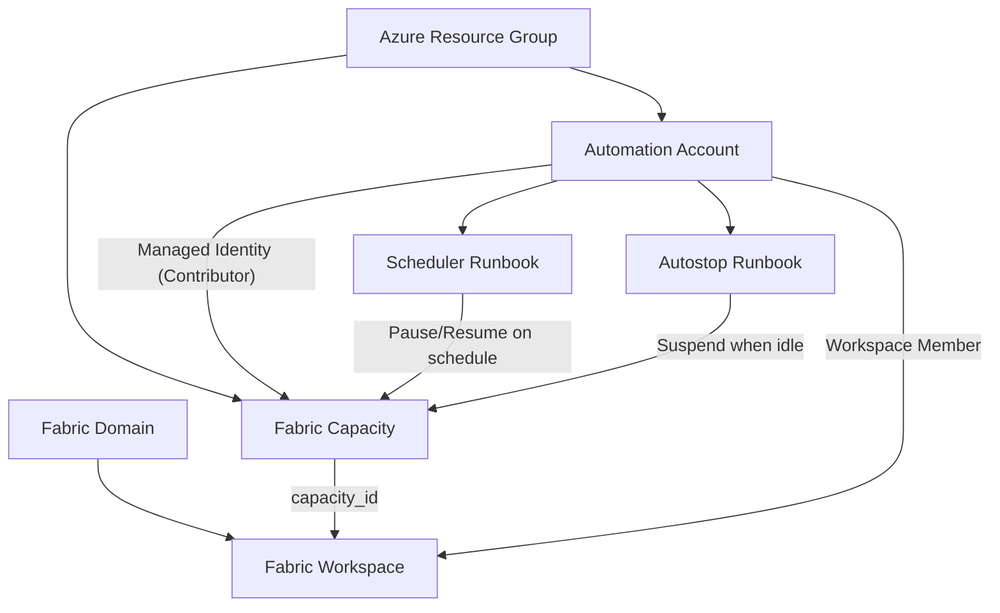

<!-- markdownlint-disable MD033 MD041 -->
<div align="center">

# 🟦 Terraform Azure Fabric Platform

**A composable Terraform module for provisioning Microsoft Fabric capacities, domains, and workspaces — with built-in cost controls.**

[](https://registry.terraform.io/modules/cloudandthings/fabric-platform/azurerm/latest)
[](https://www.terraform.io/)
[](https://registry.terraform.io/providers/microsoft/fabric/latest)
[](https://opensource.org/licenses/Apache-2.0)
[](https://pre-commit.com/)

</div>

---

## ✨ Features

- 🏗️ **Composable design** — use the full root module or pick individual sub-modules
- 💸 **Scheduled pause/resume** — automate weekly capacity downtime to cut costs
- 🛌 **Usage-based auto-pause** — suspend idle capacities based on Fabric job activity
- 🌐 **Domain & workspace management** — organize Fabric resources at scale
- 🔐 **Managed-identity workflow** — no secrets stored in Terraform state
- ✅ **Pre-commit & CI ready** — fmt, validate, tflint, checkov out of the box

## 📑 Table of Contents

- [Quick Start](#-quick-start)
- [Requirements](#-requirements)
- [Providers](#-providers)
- [Usage](#-usage)
  - [Root module](#root-module-all-resources)
  - [Sub-modules in isolation](#sub-modules-in-isolation)
- [Modules](#-modules)
- [Inputs](#-inputs)
- [Outputs](#-outputs)
- [Capacity Scheduler](#-capacity-scheduler)
- [Usage-based Auto-pause](#-usage-based-auto-pause-autostop)
- [Architecture](#-architecture)
- [Notes & Caveats](#-notes--caveats)
- [Contributing](#-contributing)
- [License](#-license)

---

## 🚀 Quick Start

> [!TIP]
> This module is published to the [Terraform Registry](https://registry.terraform.io/modules/cloudandthings/fabric-platform/azurerm/latest). Pin to a released version in production.

```hcl
module "fabric" {
  source  = "cloudandthings/fabric-platform/azurerm"
  version = "~> 1.0"

  fabric_capacities = {
    "prod-capacity" = {
      location     = "eastus2"
      sku          = "F2"
      admin_emails = ["admin@yourdomain.com"]
    }
  }

  domains = {
    "analytics" = {
      description = "Analytics domain"
      admin_principals = [{ id = "00000000-0000-0000-0000-000000000000", type = "User" }]
    }
  }

  workspaces = {
    "sales-bi" = {
      capacity_basename = "prod-capacity"
      domain_name       = "analytics"
    }
  }

  providers = {
    fabric  = fabric
    azurerm = azurerm
    azuread = azuread
    time    = time
  }
}
```

---

## 📋 Requirements

| Tool | Version |
|---|---|
| [Terraform](https://www.terraform.io/) | `>= 1.7.0` |
| [Azure CLI](https://learn.microsoft.com/en-us/cli/azure/) | latest (for `az login` authentication) |
| Microsoft Fabric tenant | with appropriate admin permissions |
| Azure subscription | with permissions to create Fabric capacities |

## 🔌 Providers

Configure these providers in your own root module and pass them to this module via the `providers` argument:

| Provider | Version | Required by |
|---|---|---|
| [`microsoft/fabric`](https://registry.terraform.io/providers/microsoft/fabric/latest) | `1.10.0` | `fabric_domain`, `fabric_workspace` |
| [`hashicorp/azurerm`](https://registry.terraform.io/providers/hashicorp/azurerm/latest) | `>= 3.98.0` | `fabric_capacity` |
| [`hashicorp/azuread`](https://registry.terraform.io/providers/hashicorp/azuread/latest) | `>= 2.47.0` | `fabric_capacity` |
| [`hashicorp/time`](https://registry.terraform.io/providers/hashicorp/time/latest) | `>= 0.9.0` | `fabric_capacity` |

Authenticate with `az login` before running `terraform apply`.

> [!IMPORTANT]
> The `fabric` provider must be configured with `preview = true` to enable Fabric preview features used by this module.

---

## 📦 Usage

### Root module (all resources)

```hcl
# provider.tf
provider "fabric" {
  tenant_id = "00000000-0000-0000-0000-000000000000"
  use_cli   = true
  preview   = true
}

provider "azurerm" {
  features {}
  subscription_id = "00000000-0000-0000-0000-000000000000"
}

provider "azuread" {
  tenant_id = "00000000-0000-0000-0000-000000000000"
}
```

```hcl
# main.tf
module "fabric" {
  source  = "cloudandthings/fabric-platform/azurerm"
  version = "~> 1.0"

  fabric_capacities = {
    "test001" = {
      location     = "eastus2"
      sku          = "F2"
      admin_emails = ["admin@yourdomain.com"]

      scheduler = {
        pause_time  = "20:00"
        resume_time = "07:00"
        pause_days  = ["Monday", "Tuesday", "Wednesday", "Thursday", "Friday"]
        resume_days = ["Monday", "Tuesday", "Wednesday", "Thursday", "Friday"]
      }

      usage_autostop = {
        check_interval_hours  = 1
        idle_threshold_checks = 2
      }
    }
  }

  domains = {
    "test-domain" = {
      description = "This is a test domain"
      admin_principals = [
        { id = "user-object-id-here", type = "User" }
      ]
    }
  }

  workspaces = {
    "test-workspace" = {
      description       = "This is a test workspace"
      capacity_basename = "test001"
      domain_name       = "test-domain"
    }
  }

  providers = {
    fabric  = fabric
    azurerm = azurerm
    azuread = azuread
    time    = time
  }
}
```

### Sub-modules in isolation

<details>
<summary><strong>Capacity only</strong> — no <code>fabric</code> provider required</summary>

```hcl
module "my_capacity" {
  source  = "cloudandthings/fabric-platform/azurerm//modules/fabric_capacity"
  version = "~> 1.0"

  basename     = "my-capacity"
  location     = "eastus2"
  sku          = "F2"
  admin_emails = ["admin@yourdomain.com"]

  providers = {
    azurerm = azurerm
    azuread = azuread
    time    = time
  }
}
```

</details>

<details>
<summary><strong>Domain only</strong></summary>

```hcl
module "my_domain" {
  source  = "cloudandthings/fabric-platform/azurerm//modules/fabric_domain"
  version = "~> 1.0"

  display_name = "my-domain"
  description  = "My Fabric domain"
  admin_principals = [
    { id = "user-object-id-here", type = "User" }
  ]

  providers = {
    fabric = fabric
  }
}
```

</details>

<details>
<summary><strong>Workspace only</strong></summary>

```hcl
module "my_workspace" {
  source  = "cloudandthings/fabric-platform/azurerm//modules/fabric_workspace"
  version = "~> 1.0"

  display_name = "my-workspace"
  capacity_id  = "/subscriptions/.../resourceGroups/.../providers/Microsoft.Fabric/capacities/my-capacity"

  providers = {
    fabric = fabric
  }
}
```

</details>

---

## 🧩 Modules

| Module | Description | Required providers |
|---|---|---|
| [`fabric_capacity`](modules/fabric_capacity) | Azure Fabric capacity + optional cost-control automation | `azurerm`, `azuread`, `time` |
| [`fabric_domain`](modules/fabric_domain) | Fabric domain with admin role assignments | `fabric` |
| [`fabric_workspace`](modules/fabric_workspace) | Fabric workspace bound to a capacity (and optionally a domain) | `fabric` |

---

## 📥 Inputs

### Root module

| Name | Type | Default | Description |
|---|---|---|---|
| `fabric_capacities` | `map(object)` | n/a | Map of Fabric capacities to create, keyed by capacity name. See [capacity attributes](#capacity-attributes). |
| `domains` | `map(object)` | n/a | Map of Fabric domains, keyed by domain name. See [domain attributes](#domain-attributes). |
| `workspaces` | `map(object)` | n/a | Map of Fabric workspaces, keyed by workspace name. See [workspace attributes](#workspace-attributes). |

#### Capacity attributes

| Attribute | Type | Default | Description |
|---|---|---|---|
| `location` | `string` | — | Azure region for the capacity. |
| `sku` | `string` | — | Fabric capacity SKU (e.g. `F2`, `F32`, `F64`, `F128`). |
| `admin_emails` | `list(string)` | — | Administrator email addresses. |
| `scheduler` | `object` | `null` | Optional weekly pause/resume schedule. See [Capacity Scheduler](#-capacity-scheduler). |
| `scheduler.pause_time` | `string` | — | Pause time in `HH:MM` UTC format. |
| `scheduler.resume_time` | `string` | — | Resume time in `HH:MM` UTC format. |
| `scheduler.pause_days` | `list(string)` | all days | Weekdays on which to pause. |
| `scheduler.resume_days` | `list(string)` | all days | Weekdays on which to resume. |
| `usage_autostop` | `object` | `null` | Optional usage-based auto-pause. See [Usage-based Auto-pause](#-usage-based-auto-pause-autostop). |
| `usage_autostop.check_interval_hours` | `number` | `1` | Poll frequency (1–24 hours). |
| `usage_autostop.idle_threshold_checks` | `number` | `2` | Consecutive idle polls before suspending. |

#### Domain attributes

| Attribute | Type | Default | Description |
|---|---|---|---|
| `description` | `string` | `""` | Description of the domain. |
| `parent_domain_id` | `string` | `""` | ID of the parent domain (for nested domains). |
| `admin_principals` | `list(object)` | — | `[{ id, type }]` — Azure AD principal object IDs and type (`User` or `Group`). |

#### Workspace attributes

| Attribute | Type | Default | Description |
|---|---|---|---|
| `description` | `string` | `""` | Description of the workspace. |
| `capacity_basename` | `string` | — | Key into `fabric_capacities` that this workspace binds to. |
| `domain_name` | `string` | `""` | Key into `domains`. Omit to skip domain assignment. |

### Sub-module: `fabric_capacity`

| Name | Type | Default | Description |
|---|---|---|---|
| `basename` | `string` | — | Base name used for resource group, capacity, and automation resources. |
| `location` | `string` | `"North Europe"` | Azure region. |
| `sku` | `string` | `"F2"` | Fabric capacity SKU. |
| `admin_emails` | `list(string)` | — | Administrator email addresses. |
| `scheduler` | `object` | `null` | See [capacity attributes](#capacity-attributes). |
| `usage_autostop` | `object` | `null` | See [capacity attributes](#capacity-attributes). |

### Sub-module: `fabric_domain`

| Name | Type | Default | Description |
|---|---|---|---|
| `display_name` | `string` | — | Display name of the Fabric domain. |
| `description` | `string` | `""` | Description of the domain. |
| `parent_domain_id` | `string` | `""` | Parent domain ID for nested domains. |
| `admin_principals` | `list(object)` | — | `[{ id, type }]` admin principals. |

### Sub-module: `fabric_workspace`

| Name | Type | Default | Description |
|---|---|---|---|
| `display_name` | `string` | — | Workspace display name. |
| `description` | `string` | `""` | Workspace description. |
| `capacity_id` | `string` | — | Azure resource ID of the Fabric capacity to bind to. |
| `fabric_domain_id` | `string` | `null` | ID of the Fabric domain to assign to. |
| `assign_to_domain` | `bool` | `false` | Whether to assign the workspace to a domain. |
| `monitor_principal_id` | `string` | `null` | Managed identity principal ID to add as workspace `Member` (typically from `fabric_capacity.monitor_principal_id`). |

---

## 📤 Outputs

### Sub-module: `fabric_capacity`

| Name | Description |
|---|---|
| `id` | Azure resource ID of the Fabric capacity. |
| `automation_account_id` | Azure resource ID of the Automation Account. `null` when both `scheduler` and `usage_autostop` are disabled. |
| `monitor_principal_id` | Principal ID of the Automation Account's managed identity. `null` when `usage_autostop` is disabled. |

### Sub-module: `fabric_domain`

| Name | Description |
|---|---|
| `id` | ID of the Fabric domain. |

---

## ⏰ Capacity Scheduler

When `scheduler` is configured, the `fabric_capacity` module provisions Azure resources to automate capacity cost management:

- 🤖 **Azure Automation Account** with a System-Assigned Managed Identity
- 🔑 **Role Assignment** — `Contributor` access on the Fabric Capacity
- 📜 **PowerShell 7.2 Runbook** ([`capacity_scheduler.ps1`](modules/fabric_capacity/scripts/capacity_scheduler.ps1)) — authenticates via Managed Identity and calls the Azure Management API
- 📅 **Two weekly schedules** — one to pause, one to resume

> [!NOTE]
> The runbook is idempotent — it checks the current capacity state before acting and skips the API call if the capacity is already in the target state.

## 🛌 Usage-based Auto-pause (autostop)

When `usage_autostop` is configured, the module deploys an additional runbook ([`capacity_autostop.ps1`](modules/fabric_capacity/scripts/capacity_autostop.ps1)) that polls accessible Fabric workspaces for active job instances and suspends the capacity after sustained idle time.

> [!WARNING]
> The Fabric Jobs API only reports **scheduled or triggered job instances**. Interactive and continuous workloads are invisible to this API and will **not** prevent suspension.

<details>
<summary>✅ <strong>Detected</strong> activity (will prevent suspension)</summary>

| Workload | Activity |
|---|---|
| Data Factory | Data pipeline runs, Dataflow Gen2 refreshes, Copy Job runs |
| Data Engineering | Notebook runs (scheduled / triggered), Spark Job Definition runs, Lakehouse table maintenance (OPTIMIZE / VACUUM) |
| Data Science | ML Experiment / ML Model training jobs (when triggered as jobs) |
| Data Warehouse | Semantic model (dataset) refreshes |
| Real-Time Intelligence | KQL Database commands triggered as job instances, Mirrored Database initial snapshots (where exposed as jobs) |

</details>

<details>
<summary>❌ <strong>NOT detected</strong> activity (capacity may be suspended while in use)</summary>

| Workload | Activity |
|---|---|
| Data Warehouse / SQL | Interactive SQL queries against Fabric Warehouses; queries against the Lakehouse SQL analytics endpoint |
| Real-Time Intelligence | Interactive KQL queries against Eventhouses, KQL Databases, KQL Querysets; Eventstream continuous ingestion; Activator (Reflex) rule evaluation; Real-Time Dashboards |
| Data Engineering | Interactive notebook sessions; Spark interactive sessions / Livy endpoint usage |
| Power BI / Data Science | Power BI report rendering, DirectQuery / Direct Lake reads, paginated reports; interactive ML Experiment exploration |
| Mirrored Database | Continuous change-data replication |

</details>

> [!TIP]
> For workloads dominated by interactive SQL, KQL, Power BI, or streaming usage, the `scheduler` option is safer — it pauses at predictable off-hours rather than relying on incomplete activity detection.

The managed identity must be a **Member** of every Fabric workspace it monitors. Workspaces created by this module are added automatically; any others must be added manually via the Fabric Admin Portal.

---

## 🏛️ Architecture



The solution creates a hierarchical structure:

1. **Azure Resource Groups** — container for Azure resources
2. **Fabric Capacities** — compute resources for Fabric workloads
3. **Fabric Domains** — organizational units for governance
4. **Fabric Workspaces** — development environments bound to capacities and domains

**Dependency order:** domains and capacities are created independently; workspaces depend on both.

---

## 📝 Notes & Caveats

- 🔐 The `fabric` provider should be configured with `preview = true` to enable preview features
- 👥 Admin emails and principal IDs must exist as valid users/groups in your Azure AD tenant
- 🌍 Fabric capacities are only available in [specific Azure regions](https://learn.microsoft.com/en-us/fabric/admin/region-availability)
- 🏷️ The `fabric_workspace` module extracts capacity names from Azure resource IDs for Fabric provider compatibility

---

## 🤝 Contributing

> This section applies to **contributors only**. End users do not need to clone the repo.

### Prerequisites

- [mise](https://mise.jdx.dev/) — manages all required tools (Terraform, tflint, Azure CLI, pre-commit, checkov)

### Setup

```bash
mise run setup
```

This installs all required tools at the correct versions and activates the pre-commit hooks.

### Pre-commit Hooks

Hooks run automatically on every `git commit` via [pre-commit-terraform](https://github.com/antonbabenko/pre-commit-terraform):

| Hook | Purpose |
|---|---|
| `terraform_fmt` | Formats all `.tf` files |
| `terraform_validate` | Validates Terraform configuration |
| `terraform_tflint` | Lints with tflint |
| `terraform_checkov` | Static security analysis |

Run all hooks manually:

```bash
pre-commit run --all-files
```

### Project Structure

```
.
├── main.tf                     # Root module: wires fabric_capacity, fabric_domain, fabric_workspace
├── variables.tf                # Root module variable definitions
├── locals.tf                   # Root module locals (domain ID lookup)
├── provider.tf                 # required_providers declaration
├── modules/
│   ├── fabric_capacity/        # Azure Fabric capacity module
│   │   └── scripts/            # PowerShell runbooks for scheduler & autostop
│   ├── fabric_domain/          # Microsoft Fabric domain module
│   └── fabric_workspace/       # Microsoft Fabric workspace module
└── README.md
```

---

## 📄 License

Licensed under the [Apache License 2.0](LICENSE). See the [LICENSE](LICENSE) file for details.